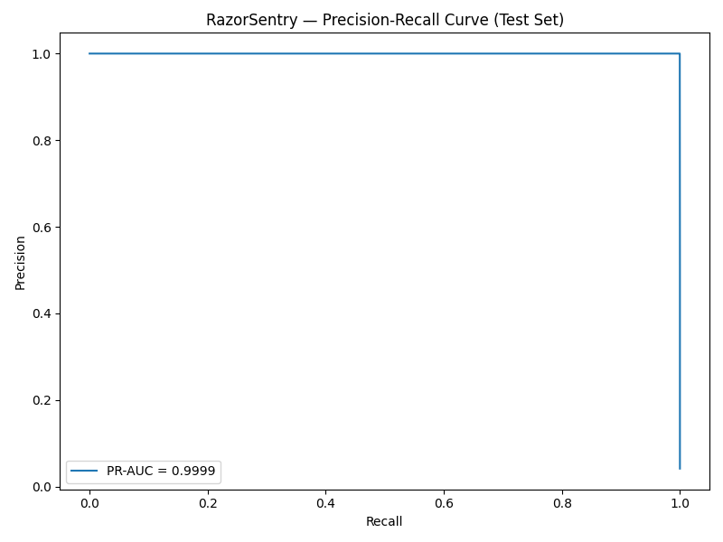
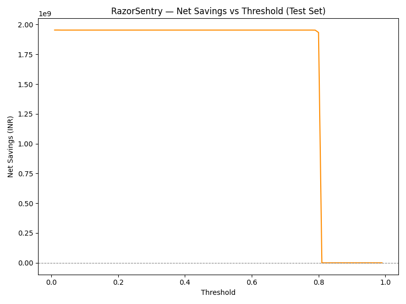
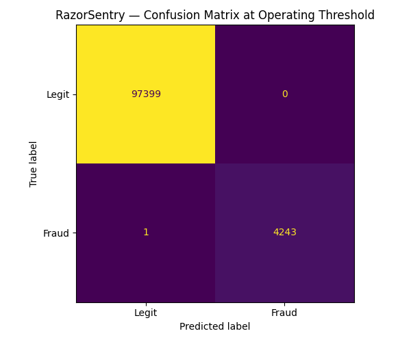
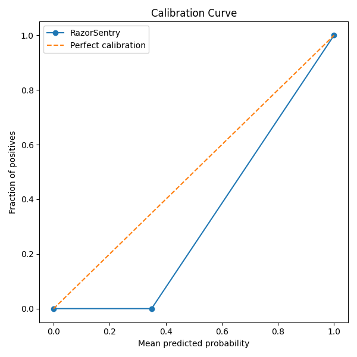
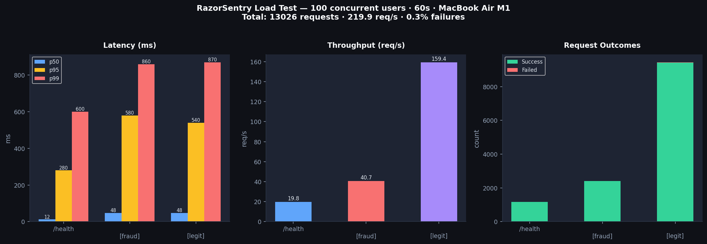

# RazorSentry

**A production-grade, cost-aware fraud decisioning service for Indian payment infrastructure.**

> Data: [PaySim Synthetic Dataset (Kaggle)](https://www.kaggle.com/datasets/mtalaltariq/paysim-data) — a synthetic mobile-money simulator. Results reflect synthetic data characteristics. The model is designed for real-time payment fraud detection and will require retraining and recalibration on live transaction data before production use. Near-perfect metrics (PR-AUC 0.9999) are expected on PaySim because the dataset encodes fraud via deterministic accounting anomalies — real-world fraud is noisier.

**Track:** AI Risk Manager — Track 02, Razorpay Buildathon 2026  
**Author:** Sayantan Mandal, Gati Shakti Vishwavidyalaya

---

## What It Does

RazorSentry scores every transaction in real time, explains why, and writes a tamper-evident blinded audit record — in under 60ms.

- **Cost-aware threshold** — threshold chosen by rupee net savings, not F1
- **Three-tier policy** — BLOCK / REVIEW / APPROVE with SHAP reason codes
- **PII blinding** — HMAC-SHA256 hashes identifiers before audit log storage
- **Live monitoring** — EWMA spike detector + PSI drift detector on the dashboard
- **Async scoring path** — Redis Queue decouples burst acceptance from processing
- **Razorpay webhook** — POST /webhook/razorpay accepts payment.failed events natively

For full architecture details see [ARCHITECTURE.md](ARCHITECTURE.md).  
For the development journey, decisions, and what broke see [DEVLOG.md](DEVLOG.md).

---

## Model Performance

> Trained and evaluated on [PaySim synthetic data](https://www.kaggle.com/datasets/mtalaltariq/paysim-data). These numbers reflect synthetic data — see the note at the top.

| Metric | Value |
|--------|-------|
| PR-AUC | 0.9999 |
| Precision @ threshold | 1.000 |
| Recall @ threshold | 0.9998 |
| Operating threshold | 0.35 (isotonic calibration) |
| False positives | 0 on test set |
| False negatives | 1 on test set |
| Net savings (test set) | ₹195.36 Cr across 101,643 transactions |
| False positive cost assumption | ₹150/txn |

### Precision-Recall Curve


### Cost vs Threshold (Operating Point Selection)


> The flat curve reflects PaySim's deterministic fraud encoding. On real data this curve has a clear peak — the cost model still applies and will select the optimal threshold on live data.

### Confusion Matrix at Operating Threshold (0.35)


### Probability Calibration Curve


> Isotonic calibration moved the threshold from 0.02 to 0.35 — scores are now interpretable probabilities.

---

## Infrastructure

| Component | Technology | Purpose |
|-----------|------------|---------|
| API Server | FastAPI + 4 uvicorn workers | Parallel request handling |
| Sync scoring | POST /score | Sub-60ms real-time decisions |
| Async scoring | POST /score/async + Redis RQ | Burst traffic decoupling |
| Database | PostgreSQL 16 (Docker) | Append-only audit log with connection pooling |
| Queue | Redis 7 (Docker) | RQ job queue for async scoring |
| Privacy | HMAC-SHA256 PII blinding | Account IDs never stored in plaintext |
| Monitoring | GET /dashboard | Live fraud ops dashboard, auto-refresh 10s |
| Drift detection | PSI monitor | Alerts when incoming distribution shifts from training |

---

## Load Test Results

100 concurrent users · 60 seconds · MacBook Air M1 · `docker compose up` (4 workers + PostgreSQL + Redis)



| Metric | /score [legit] | /score [fraud] | /health |
|--------|---------------|----------------|---------|
| Requests | 9,440 | 2,412 | 1,174 |
| Failures | 29 (0.31%) | 7 (0.29%) | 0 |
| p50 latency | 48ms | 48ms | 12ms |
| p95 latency | 540ms | 580ms | 280ms |
| p99 latency | 870ms | 860ms | 600ms |
| Throughput | 159.4 req/s | 40.7 req/s | 19.8 req/s |

**Total: 219.9 req/s sustained · 99.7% success rate**

Bottleneck: SHAP TreeExplainer adds ~10-15ms per request. Production mitigation: async SHAP annotation after the decision is logged. Horizontal scaling grows throughput linearly.

---

## Quickstart

> **Deployment Note:** RazorSentry requires three services running
> simultaneously — FastAPI, PostgreSQL, and Redis. Free cloud tiers
> (Railway, Render, Fly.io) either limit you to one free service or
> sleep containers after inactivity, making a reliable public demo
> impractical without paid infrastructure. The project is designed for
> `docker compose up` — one command starts all services locally.
> The 5-minute demo video shows the full system running end to end.

```bash
git clone https://github.com/Sayantan181222/RazorSentry.git
cd RazorSentry

# Download PaySim CSV from https://www.kaggle.com/datasets/mtalaltariq/paysim-data
# Place at data/PaySim.csv

python src/data_loader.py
python src/train.py
make eval

# Start all services
docker compose up --build -d
docker compose ps

# Open dashboard
open http://localhost:8000/dashboard

# Demo curl
bash scripts/demo_curl.sh

# Inspect audit log
make db-shell
```

### Environment Variables (.env)
```env
DATABASE_URL=postgresql://razorsentry:razorsentry_pass@db:5432/razorsentry
REDIS_URL=redis://redis:6379
GROQ_API_KEY=your_groq_key_here
PII_SALT=your_secret_salt_here
LOAD_TEST_MODE=false
```

---

## Demo Video

The 5-minute pitch video covers:
- Live scoring demo via `bash scripts/demo_curl.sh`
- Async scoring via POST /score/async with job polling
- Dashboard at `http://localhost:8000/dashboard` showing live decisions
- Data drift simulation via `python scripts/simulate_drift.py` —
  dashboard flips from ✅ Stable to 🔴 DRIFT ALERT (PSI > 0.2) in real time
- Metrics walkthrough: PR curve, cost curve, confusion matrix, top FP cases
- Architecture explanation and what broke

> Video link: [To be added after recording]

---

## API Endpoints

| Method | Path | Description |
|--------|------|-------------|
| POST | `/score` | Sync scoring — decision in under 60ms |
| POST | `/score/async` | Async — returns job_id, poll for result |
| GET | `/score/result/{job_id}` | Poll async result |
| POST | `/batch` | Score a list of transactions |
| POST | `/webhook/razorpay` | Ingest Razorpay payment.failed events |
| GET | `/decisions/{decision_id}` | Retrieve decision by UUID |
| GET | `/monitor/spike` | EWMA fraud spike status |
| GET | `/monitor/drift` | PSI feature drift status |
| GET | `/dashboard` | Live monitoring dashboard |
| GET | `/health` | Service liveness |
| GET | `/ready` | Readiness — 503 until model and DB are live |
| GET | `/health/pool` | PostgreSQL connection pool stats |

---

## AI Judgment

LightGBM makes every money decision. Groq LLaMA (llama-3.1-8b-instant) drafts a 2-line analyst note for REVIEW-queue items only — after the decision is already final. The LLM never touches the scoring path. The EWMA spike monitor and PSI drift detector are deliberately LLM-free: pure statistics, fast, no hallucination risk.

---

## Data Drift Demo

```bash
python scripts/simulate_drift.py
```

Sends 50 normal transactions then pauses. Open the dashboard. Press Enter to send 50 drifted transactions simulating a festival-season CASH_OUT fraud ring (₹4.5L-9.5L). The Feature Drift Monitor flips from ✅ Stable to 🔴 DRIFT ALERT (PSI > 0.2) in real time.

---

## What Broke and How It Was Fixed

**Temporal leakage** — velocity features computed before the train/test split inflated PR-AUC. Fixed by computing all features strictly within split boundaries.

**LabelEncoder at inference** — re-fitting on a single row gave wrong type encoding. Fixed with a hardcoded TYPE_ENCODING dict.

**drain_flag on zero-balance accounts** — amount >= 0.9 * 0 is always True. Fixed with a non-zero guard on oldbalanceOrg.

**CI/CD: ModuleNotFoundError** — pytest could not find src in GitHub Actions. Fixed by adding sys.path.insert to conftest.py directly.

**PII blinding not firing** — 2006 old records stored raw account IDs before privacy.py was wired in. Confirmed fix: SENSITIVE_ACCOUNT_99999 stored as 2e10c17cfbb44f3d in PostgreSQL.

**Load test 89.6% failures** — all 429s from the per-IP rate limiter. Fixed by adding LOAD_TEST_MODE env flag to bypass rate limiting for benchmarking.

---

## Model Card

| Field | Detail |
|-------|--------|
| Training data | [PaySim (Kaggle)](https://www.kaggle.com/datasets/mtalaltariq/paysim-data) — synthetic — 500k legit + all fraud rows |
| Fraud rate (train) | 0.98% |
| Fraud rate (test) | 4.18% — fraud concentrates in later time steps |
| Features | balance_error_orig, balance_error_dest, drain_flag, zero_orig_after, type_encoded, amount_log, orig_txn_count_1h, orig_txn_sum_1h, dest_in_degree_1h, high_amount_flag |
| Model | LightGBM + Isotonic calibration (CalibratedClassifierCV) |
| Threshold | 0.35 — chosen by rupee net-savings maximisation, not F1 |
| Not intended for | Deployment on real data without retraining · High-value (>₹10L) decisions without human review · Offensive fraud research |
